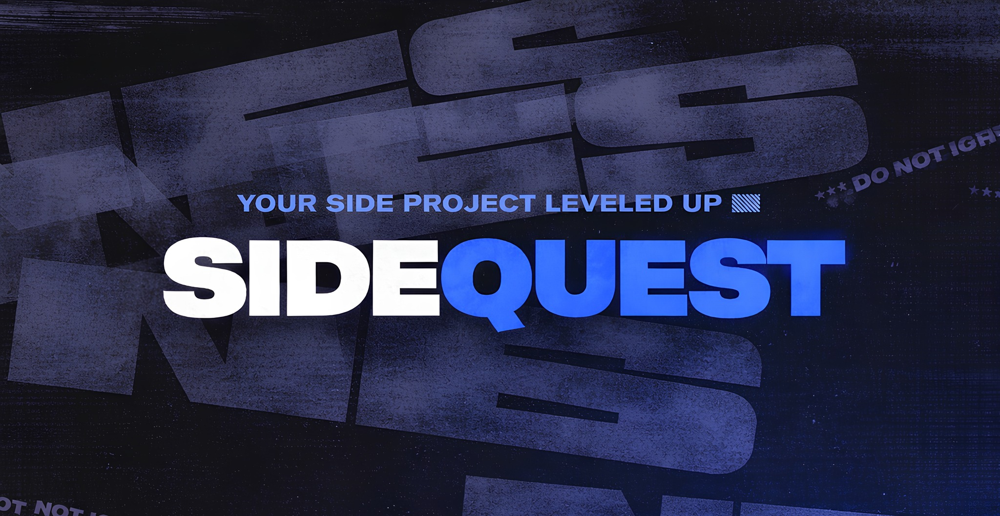

# SideQuest Studio

**A group of multi-talented individuals with different forte in technology**

 

 

## About

SideQuest Studio is a collective of developers and designers working across the full spectrum of technology — from interfaces to infrastructure. Each member brings a distinct specialty, allowing the team to take on projects end-to-end without outside dependencies.

 

## Services

<table width="100%">
<tr>
<td align="center" width="33%" valign="top">

**Frontend Development**

Responsive, accessible interfaces built with modern frameworks and clean, maintainable code.

`React` `Next.js` `Tailwind CSS`

</td>
<td align="center" width="33%" valign="top">

**Backend Development**

Reliable APIs, database architecture, and server-side systems built to scale.

`Node.js` `Express` `PostgreSQL`

</td>
<td align="center" width="33%" valign="top">

**Full-Stack Development**

Complete, end-to-end product builds — from database to interface.

`MERN` `REST APIs` `System Integration`

</td>
</tr>
<tr>
<td align="center" width="33%" valign="top">

**Mobile Development**

Native and cross-platform apps designed for performance and usability.

`React Native` `Flutter` `Android`

</td>
<td align="center" width="33%" valign="top">

**Automation**

Custom scripts and tools that eliminate repetitive work and streamline delivery.

`Python` `Scripting` `Workflow Tools`

</td>
<td align="center" width="33%" valign="top">

**Graphic Design**

Visual identity, branding, and design assets that make products stand out.

`Figma` `Branding` `UI/UX`

</td>
</tr>
</table>

 

## Tech Stack

<!-- Swap/add badges below to match what your team actually uses -->

**Languages & Frameworks**

**Databases**

**Cloud & Hosting**

**Tools & Platforms**

**Design**

 

## Team Founder

<table width="100%">
<tr>
<td align="center" width="20%">
  
<b>Abdul Barry Adam</b> 
Full-Stack Developer 
<a href="https://github.com/WareBar">@WareBar</a>
</td>
<td align="center" width="20%">
  
<b>Kurt Atoat</b> 
Frontend Engineer 
<a href="https://github.com/seiyanndev">@seiyanndev</a>
</td>
<td align="center" width="20%">
  
<b>James Patrick De Mesa</b> 
Full-Stack Developer 
<a href="https://github.com/SaucesCode">@SaucesCode</a>
</td>
<td align="center" width="20%">
  
<b>Steven Maraig</b> 
Systems Developer 
<a href="https://github.com/Meinya312">@Meinya312</a>
</td>
<td align="center" width="20%">
  
<b>Ryann Kim Sesgundo</b> 
Systems Architect 
<a href="https://github.com/RyannKim327">@RyannKim327</a>
</td>
</tr>
</table>

 

## Activity

We track our team's contributions and progress publicly in real time.

[**View the DevPulse Leaderboard →**](https://devpulse-olive.vercel.app/leaderboard/mga-tambay-sa-comlab)

 

## Connect

 

© 2026 SideQuest Studio · Built by the team, for the team

